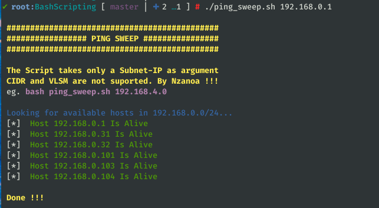
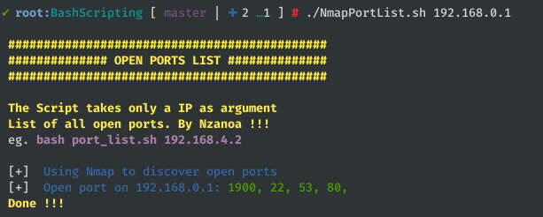

# CyberSecurity
## Few scripts necessary for Pentesters

### PING SWEEP
This script will help you discover hosts alive in a subnet.

> bash Enumeration/PingSweep.sh

### FULL PORTS LIST
This script will provide a list of all open port on a machine formated in a way that can be easily reused by other scanning tools.

> bash Enumeration/PortList.sh

### SEND ANONYMOUS EMAIL
This script will help you sending anonymous email to a specified Email address.

> python3 AnonymousEmail.py

### BRUTEFORCE ZIP
This Script will help you bruteforce a zip file.

> python3 BruteForceZip.py --zipfile file.zip --passfile pwd.txt

### BRUTEFORCE FTP
This Script will help you bruteforce remotely a ftp account.

> python3 BruteForceFTP.py --ftp 10.1.1.1 --username admin --passfile pwd.txt
